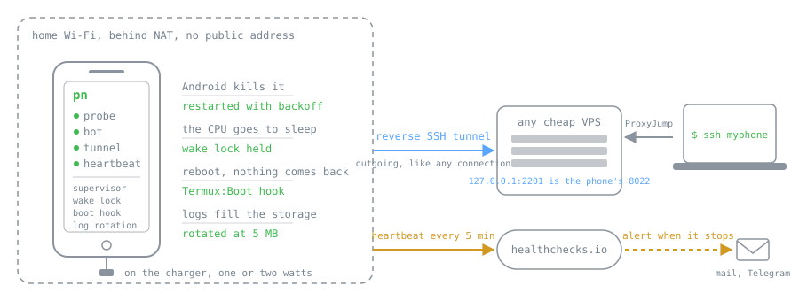
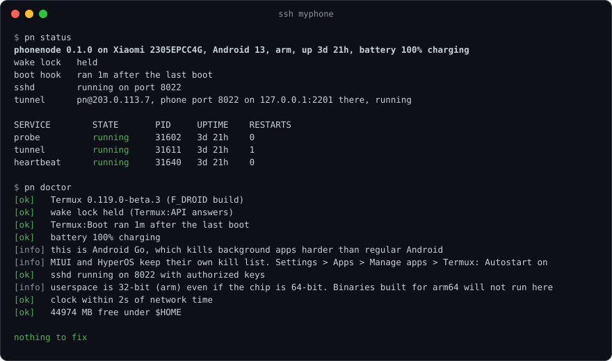

# phonenode

<p align="center">
  <a href="../../README.md"></a>
  <a href="README.ru.md"></a>
  <a href="README.zh-CN.md"></a>
  
  <a href="README.pt-BR.md"></a>
  <a href="README.de.md"></a>
  <a href="README.fr.md"></a>
  <a href="README.ja.md"></a>
  <a href="README.hi.md"></a>
  <a href="README.id.md"></a>
</p>

[](https://github.com/macintoshi-nakamoto/phonenode/actions/workflows/ci.yml)


Convierte un Android viejo en un servidor siempre encendido. Sin root, sin ROM personalizada, con un solo comando.

Un teléfono viejo es una pequeña máquina Linux con una batería que hace de SAI y que consume uno o dos vatios. Hacer que algo corra en él nunca fue lo difícil. Lo difícil es que seis horas después Android lo ha matado, o el teléfono se reinició y no volvió nada, o está detrás del NAT de tu router donde no puedes llegar, o los logs se comieron el almacenamiento y te enteraste una semana después. phonenode es el conjunto de cosas que necesitas para que el teléfono siga arriba y siga accesible, más un `doctor` que te dice cuál de ellas falta en tu teléfono.

Yo tengo una sonda de medición de red corriendo en un POCO C51 que costó unos cincuenta dólares. Vive en un cajón con Wi-Fi, reporta cada quince minutos, ha sobrevivido reinicios y Android Go, y entro por ssh desde cualquier sitio a través de un VPS de dos dólares. Todo lo que tuve que aprender para llegar ahí está en este repositorio, para que tú no tengas que aprenderlo otra vez.

<p align="center"></p>

## Qué obtienes

| Por qué mueren los servidores en teléfonos | Qué hace phonenode al respecto |
|---|---|
| Android mata los procesos en segundo plano | un supervisor por servicio que lo reinicia con espera creciente, y un script que saca a Termux de la lista negra de batería desde tu ordenador |
| la CPU duerme y los temporizadores se desvían o saltan tarde | mantiene un wake lock a través de Termux:API |
| tras un reinicio no arranca nada | un hook de Termux:Boot lo levanta todo, y abrir Termux a mano hace lo mismo si el sistema alguna vez bloquea el hook |
| el teléfono está detrás de NAT | un túnel SSH inverso a cualquier VPS, así `ssh myphone` funciona desde cualquier sitio |
| te enteras de que murió una semana después | un latido a healthchecks.io o a cualquier URL, para que algo fuera del teléfono se dé cuenta |
| los logs llenan el almacenamiento | rotación, porque nada más en un teléfono lo hará |
| no sabes cuál de las anteriores falla | `pn doctor` |

## Instalación

En el teléfono, dentro de Termux. Usa la versión de Termux de F-Droid, la de Play Store está abandonada y no puede instalar paquetes.

```
curl -fsSL https://raw.githubusercontent.com/macintoshi-nakamoto/phonenode/main/install.sh | bash
```

También necesitas dos aplicaciones pequeñas de F-Droid, del mismo sitio que Termux: **Termux:API** (wake lock, estado de la batería) y **Termux:Boot** (arranque al iniciar). Abre Termux:Boot una vez después de instalarlo. Android no lo ejecutará al arrancar hasta que haya sido abierto.

El instalador deja todo en `~/.phonenode`, enlaza `pn` en tu PATH, instala el hook de arranque y ejecuta `pn doctor`. Lee lo que dice el doctor, conoce a tu fabricante.

## Uso

```
pn add bot 'python bot.py' --dir ~/bot
pn start bot
pn status
pn logs bot -f
```

`pn add` recibe un nombre y una línea de comando. El comando corre bajo su propio supervisor. Cuando termina, se arranca de nuevo a los cinco segundos, doblando hasta cinco minutos si sigue muriendo, y de vuelta a cinco segundos en cuanto aguanta un minuto. `pn stop` lo para y deja de reiniciarlo. `pn restart` aplica un comando cambiado. Todo sobrevive a un reinicio.

```
pn doctor
```

recorre la lista de cosas que matan un servidor en un teléfono y dice qué arreglar, con la ruta del menú para tu fabricante. También te dice si Termux:Boot realmente se ejecutó tras el último reinicio, que es lo único que no puedes ver desde los ajustes.

<p align="center"></p>

## Llega a él desde cualquier sitio

Un teléfono en la Wi-Fi de casa no tiene dirección pública. Cualquier VPS barato lo resuelve: el teléfono mantiene una conexión SSH abierta hacia él y le pide que reenvíe un puerto de vuelta.

```
pn tunnel pn@203.0.113.7 2201
```

Esto crea una clave, imprime la línea exacta de `authorized_keys` para el VPS (restringida para que la clave pueda reenviar un puerto y nada más), imprime la entrada de `~/.ssh/config` para tu portátil, y configura un servicio llamado `tunnel` que mantiene viva la conexión. Después de eso, `ssh myphone` desde el portátil aterriza en el teléfono. Crea un usuario sin privilegios aparte en el VPS para esto, la línea que imprime el comando asume que lo hiciste.

## Entérate cuando muera

```
pn heartbeat https://hc-ping.com/your-uuid 5
```

llama a esa URL cada cinco minutos. Regístrate en healthchecks.io (gratis), crea un check con un periodo de cinco minutos, y te enviará un correo o un mensaje cuando el teléfono deje de reportar. Vale cualquier URL que acepte un GET, así que un endpoint diminuto en tu propio servidor también sirve.

## Saca a Termux de la lista negra desde tu ordenador

Android tiene una lista blanca de aplicaciones que pueden correr en segundo plano, y los fabricantes añaden sus propias listas encima. Algunos de esos interruptores están a cinco toques de profundidad y cambian según el teléfono. Con la depuración USB activada, este script cambia los que adb puede alcanzar:

```
bash tools/unleash.sh
```

Añade Termux, Termux:Boot y Termux:API a la lista blanca de Doze, les permite correr en segundo plano, abre Termux:Boot una vez para que Android lo acepte como receptor de arranque, y le dice a la Wi-Fi que siga encendida con la pantalla apagada. Los ajustes del fabricante que adb no alcanza los imprime `pn doctor` en el teléfono.

## Qué no es

No es root y no sustituye el sistema, así que el teléfono sigue haciendo todo lo que hacía antes, y tus datos no se tocan.

No es un sistema init completo. Si quieres archivos de servicio al estilo runit con dependencias, `pkg install termux-services` lo hace bien. phonenode va de que el teléfono sobreviva y sea accesible, y ejecuta cualquier cosa, incluido `sv` de termux-services, bajo su supervisor.

No es una VPN y no abre puertos en tu router. El túnel sale desde el teléfono, como cualquier otra conexión saliente.

## Probado en

| Teléfono | Android | Espacio de usuario | Notas |
|---|---|---|---|
| POCO C51 (Xiaomi 2305EPCC4G) | 13 Go | arm de 32 bits sobre un chip de 64 | el teléfono de referencia, en producción desde septiembre de 2026 |

Los reportes desde otros teléfonos son la contribución más útil que existe. Abre un issue con el modelo, la versión de Android, la salida de `pn doctor` y cuánto tiempo lleva encendido.

## Cosas que me mordieron

Cada una costó una tarde. El doctor ahora las comprueba.

- **El espacio de usuario puede ser de 32 bits en un chip de 64.** Los teléfonos baratos traen un Termux armeabi-v7a sobre una CPU arm64. `uname -m` dice armv8l y miente, `dpkg --print-architecture` dice arm y acierta. Un binario arm64 ni siquiera arranca.
- **No hay almacén de CA.** Los binarios de Go y Rust verifican TLS contra el almacén del sistema, Termux no tiene ninguno hasta `pkg install ca-certificates`, y los binarios estáticos además necesitan `SSL_CERT_FILE=$PREFIX/etc/tls/cert.pem` para encontrarlo. El síntoma parece una red rota.
- **No hay `/etc/resolv.conf`.** Las herramientas propias de Termux resuelven nombres a través de Android. Un binario estático no, y falla en cada consulta DNS hasta que lo apuntas a un resolutor. `getprop net.dns1` muestra uno, el router normalmente también vale.
- **`/proc` está casi cerrado.** En Android 13 una aplicación no puede leer `/proc/uptime` ni `/proc/net/tcp`, y `pgrep` puede perder procesos porque los nombres que ve están truncados. phonenode lee el tiempo encendido desde `/proc/self/stat` y comprueba sshd conectándose a él.
- **Los comandos de Termux:API se cuelgan para siempre si falta la aplicación Termux:API.** No es un error, es un cuelgue. Todo en phonenode los llama bajo `timeout`.
- **Nunca hagas `scp` encima de un script que está corriendo.** bash lee los scripts por trozos, `scp` trunca y reescribe el mismo archivo, y la copia en ejecución lee basura o se bifurca dos veces. Escribe un archivo nuevo y haz `mv`. Así es como una vez tuve dos supervisores en un teléfono.
- **`pkill -f` por nombre matará tu propio supervisor** si su línea de comando contiene el nombre que buscas. phonenode mata por pid desde archivos, y la línea de comando del supervisor no contiene tu comando.
- **Android Go es otro animal.** Mata aplicaciones en segundo plano con mucha más alegría. Ahí los ajustes de batería no son opcionales, y la prueba del reinicio es la única evidencia.

## Contribuir

Pull requests pequeños, una cosa cada uno. `shellcheck` debe estar limpio y `tests/smoke.sh` debe pasar, ambos corren en CI en cada push. Bash a propósito: cualquiera puede abrir los scripts y ver qué le hacen a su teléfono antes de ejecutarlos.

Las traducciones viven en `docs/i18n`. Si la tuya se lee mal, arréglala, el archivo en inglés es la referencia.

## Licencia

MIT.
